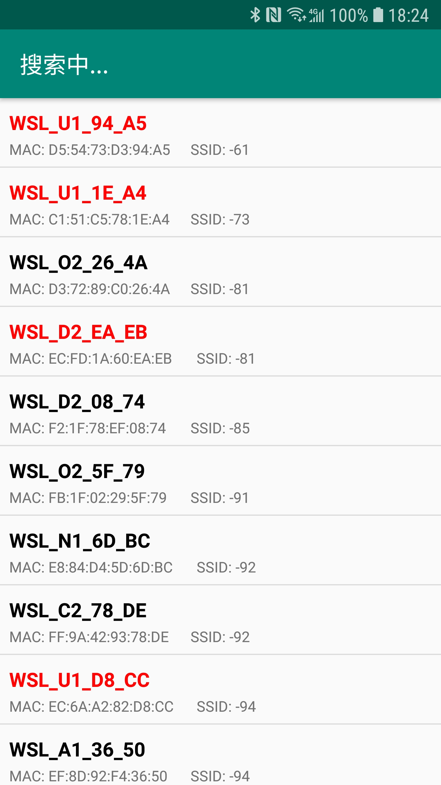
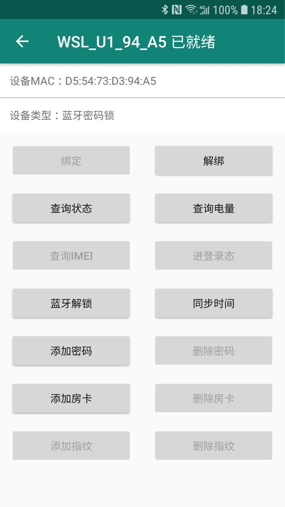
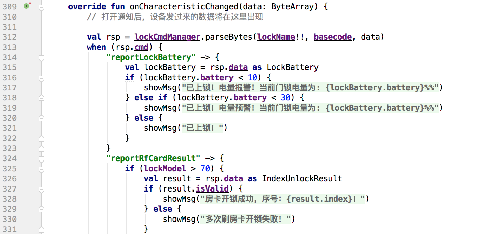

# 智能门锁android sdk

此插件封装了智能锁蓝牙通信协议部分，通过接口函数轻松生成蓝牙指令，开发者只需将指令通过蓝牙发送出去，再解析指令回复获取结果。
>功能示例
>* 1.扫描锁蓝牙

>* 2.WSL_Ux蓝牙密码锁系列

***
## 1.工程SDK配置

1.1 工程主module的libs导入smartlock-sdk-v1.2.0.jar包

1.2 申请sdk appkey
  发送邮件至logsoul@qq.com，申请appKey， 注明申请app主体信息，联系方式，bundleId，应用名称，应用说明，我们将于1～2个工作日处理。

1.3 插件初始化
<pre><code>
//初始化
var lockCmdManager: LockCmdManager = LockCmdManager()
val data = lockCmdManager.intSdk(this, "your bundleId", "your appKey")
Log.e("[initSdk]", data.toString())
...
//生成指令
writeBytes(targetBleDevice!!, lockCmdManager.sendBindLock(lockName!!, lockId, lockManagerId, basecode))
 ...
 //解析指令回复json数据
val rsp = lockCmdManager.parseBytes(lockName!!, basecode, data)
when (rsp.cmd) {
    "queryLockState" -> {
        if (rsp.code == 200) {
            val lockState = rsp.data as LockState
        }
    }
}
</code></pre> 

***
## 2. 通用指令接口

### 2.1 指令回复解析 parseBytes
  >CmdRspData parseBytes(String devName, int basecode, bytes[] data)
  >* params: 
    >>devName: String类型，锁蓝牙名称，
    >>basecode: int类型，8位素数，用于蓝牙通信解密
    >>data: 接收到的蓝牙回复数据

  >* return json:
    >>cmd: String类型，函数接口名称，
    >>code: int类型，200表示指令返回预期结果，300表示指令错误
    >>data: object类型，指令返回数据。

>示例代码

### 2.2 查询门锁绑定状态及mac地址 queryLockState  
  >bytes[] queryLockState(String devName)
  >* params: 
    >>devName: String类型，锁蓝牙名称

  >* return data: 
    >>isBind: bool类型，表示锁硬件绑定状态，
    >>mac: String类型，表示锁的蓝牙MAC地址

### 2.3 查询门锁电量信息 queryLockBattery  
  >bytes[] queryLockBattery(String devName)
  >* params: 
    >>devName: String类型，锁蓝牙名称

  >* return data: 
    >>battery: int类型，表示锁电池电量百分比

  注意：开锁成功，会主动上报电量，主动上报接口名称为reportLockBattery。

### 2.4 绑定门锁 sendBindLock  
  >bytes[] sendBindLock(String devName, int lockId, int managerId, int basecode)
  >* params: 
    >>devName: String类型，锁蓝牙名称
    >>lockId: int类型，锁注册id
    >>managerId: int类型，锁管理员id
    >>basecode: int类型，8位素数，用于蓝牙通信加密，建议每一把锁提供不同的basecode

  >* return: 
    >>code: int类型，200表示绑定成功，300表示绑定失败

### 2.5 解绑门锁 sendUnbindLock  
  >bytes[] sendUnbindLock(String devName, int lockId, int managerId, int basecode)
  >* params: 
    >>devName: String类型，锁蓝牙名称
    >>lockId: int类型，锁注册id
    >>managerId: int类型，锁管理员id
    >>basecode: int类型，绑定时生成

  >* return: 
    >>code: int类型，200表示解绑成功，300表示解绑失败

### 2.6 蓝牙开锁 sendOpenLockP1/sendOpenLockP2 
  >bytes[] sendOpenLockP1(String devName, int basecode)
  >* params: 
    >>devName: String类型，锁蓝牙名称
    >>basecode: int类型，蓝牙通信加密码  

   >* return data: 
    >>randomN: int类型，解锁第二步加密参数

  >bytes[] sendOpenLockP2(String devName, int basecode, int randomN)
  >* params: 
    >>devName: String类型，锁蓝牙名称
    >>basecode: int类型，蓝牙通信加密码  
    >>randomN: int类型，解锁第一步返回

  >* return: 
    >>code: int类型，200表示蓝牙开锁成功，300表示蓝牙开锁失败

## 3. 蓝牙密码锁WSL_Ux，NB密码锁WSL_Nx和WSL_Mx系列锁指令接口

### 3.1 同步时钟 syncClock
  >byte[] syncClock(String devName, int basecode, Date time)
  >* params: 
    >>devName: String类型，锁蓝牙名称
    >>basecode: int类型，蓝牙通信加密码
    >>time: Date类型，本地时钟，例如中国为UTC+8时间

  >* return: 
    >>code: int类型，200表示同步时钟成功，300表示同步时钟失败
注意：当密码，刷卡无法开门，或重启后，需要更新时钟。  

### 3.2 添加限时密码 addPincode
  >bytes[] addPincode(String devName, int basecode, int pincode, int index, Date startTime, Date endTime)
  >* params: 
    >>devName: String类型，锁蓝牙名称
    >>basecode: int类型，蓝牙通信加密码
    >>pincode: int类型，6位开锁密码
    >>index: int类型，密码序号，0～99，不需要，传0
    >>startTime: Date类型，密码生效时间，取本地时钟，例如中国为UTC+8时间
    >>endTime: Date类型，密码失效时间，取本地时钟，例如中国为UTC+8时间

  >* return: 
    >>code: int类型，200表示添加成功，300表示添加失败 

  注意：密码开锁结果上报，接口名称reportPincodeResult，数据结构如下：
  {
    > pincode: int类型，表示开锁密码
    > time: date类型，表示开锁时间
    > type: int类型, 表示密码类型
    > isValid: bool类型，表示密码是否开锁成功
  }   

### 3.3 删除限时密码 delPincode
  >bytes[] delPincode(String devName, int basecode, int pincode, int index)
  >* params: 
    >>devName: String类型，锁蓝牙名称
    >>basecode: int类型，蓝牙通信加密码
    >>pincode: int类型，6位开锁密码
    >>index: int类型，密码序号，0～99，不需要，传0

  >* return: 
    >>code: int类型，200表示删除成功，300表示删除失败     

### 3.4 添加限时房卡 addRfCard
  >bytes[] addRfCard(String devName, int basecode, int cardId, int index, Date startTime, Date endTime)
  >* params: 
    >>devName: String类型，锁蓝牙名称
    >>basecode: int类型，蓝牙通信加密码
    >>cardId: int类型，房卡卡号
    >>index: int类型，房卡序号，0～99，不需要，传0
    >>startTime: Date类型，房卡生效时间，取本地时钟，例如中国为UTC+8时间
    >>endTime: Date类型，房卡失效时间，取本地时钟，例如中国为UTC+8时间

  >* return: 
    >>code: int类型，200表示添加成功，300表示添加失败    

  注意：刷卡开锁结果上报，接口名称reportRfCardResult，数据结构如下：
  {
    > cardId: int类型，表示房卡卡号
    > time: date类型，表示开锁时间
    > type: int类型, 表示房卡类型
    > isValid: bool类型，表示房卡是否开锁成功
  } 
  
### 3.5 删除限时房卡 delRfCard
  >bytes[] delRfCard(String devName, int basecode, int cardId, int index)
  >* params: 
    >>devName: String类型，锁蓝牙名称
    >>basecode: int类型，蓝牙通信加密码
    >>cardId: int类型，房卡卡号
    >>index: int类型，房卡序号，0～99，不需要，传0

  >* return: 
    >>code: int类型，200表示删除成功，300表示删除失败    

## 4. 蓝牙密码锁WSL_Ox，NB密码锁WSL_Dx，蓝牙指纹锁WSL_Fx，NB指纹锁WSL_Cx系列锁指令接口

### 4.1 登录态 login1/login2
  >bytes[] login1(String devName, int basecode)
  >* params: 
    >>devName: String类型，锁蓝牙名称
    >>basecode: int类型，蓝牙通信加密码  

   >* return data: 
    >>randomN: int类型，解锁第二步加密参数

  >bytes[] login2(String devName, int basecode, int randomN)
  >* params: 
    >>devName: String类型，锁蓝牙名称
    >>basecode: int类型，蓝牙通信加密码  
    >>randomN: int类型，解锁第一步返回

  >* return: 
    >>code: int类型，200表示登录成功，300表示登录失败
注意：登录态表示一种鉴权行为。同步时钟，管理密码，房卡，指纹，均需要先登录后方可操作。

### 4.2 同步时钟 syncClock
  >bytes[] syncClock(String devName, int basecode, Date time)
  >* params: 
    >>devName: String类型，锁蓝牙名称
    >>basecode: int类型，蓝牙通信加密码
    >>time: Date类型，本地时钟，例如中国为UTC+8时间

  >* return: 
    >>code: int类型，200表示同步时钟成功，300表示同步时钟失败  
    >>data: object类型，其中msg表示提示信息   
注意：当密码，刷卡，指纹无法开门，或重启后，需要更新时钟。  

### 4.3 添加限时密码 addPincode
  >bytes[] addPincode(String devName, int basecode, int pincode, int index, Date startTime, Date endTime)
  >* params: 
    >>devName: String类型，锁蓝牙名称
    >>basecode: int类型，蓝牙通信加密码
    >>pincode: int类型，6位开锁密码
    >>index: int类型，密码序号，0～99
    >>startTime: Date类型，密码生效时间，取本地时钟，例如中国为UTC+8时间
    >>endTime: Date类型，密码失效时间，取本地时钟，例如中国为UTC+8时间

  >* return: 
    >>code: int类型，200表示添加成功，300表示添加失败    
    >>data: object类型，其中msg表示提示信息   
  注意：密码开锁结果上报，接口名称reportPincodeResult，数据结构如下：
  {
    > index: int类型，表示密码序号
    > time: date类型，表示开锁时间
    > isValid: bool类型，表示密码是否开锁成功
  }   

### 4.4 删除限时密码 delPincode
  >bytes[] delPincode(String devName, int basecode, int pincode, int index)
  >* params: 
    >>devName: String类型，锁蓝牙名称
    >>basecode: int类型，蓝牙通信加密码
    >>pincode: int类型，6位开锁密码，不需要，传0
    >>index: int类型，密码序号，0～99，必须

  >* return: 
    >>code: int类型，200表示删除成功，300表示删除失败  

### 4.5 添加限时房卡 addRfCard
  >bytes[] addRfCard(String devName, int basecode, int cardId, int index, Date startTime, Date endTime)
  >* params: 
    >>devName: String类型，锁蓝牙名称
    >>basecode: int类型，蓝牙通信加密码
    >>cardId: int类型，房卡卡号，不需要，传0
    >>index: int类型，房卡序号，0～99，必须
    >>startTime: Date类型，房卡生效时间，取本地时钟，例如中国为UTC+8时间
    >>endTime: Date类型，房卡失效时间，取本地时钟，例如中国为UTC+8时间

  >* return: 
    >>code: int类型，100时，表示进入添卡模式，200表示添加成功，300表示添加失败
    >>data: object类型，其中msg表示提示信息   
注意：指纹锁系列添加房卡，是先发送指令进入添卡模式，再刷卡完成添加。
  >密码开锁结果上报，接口名称reportRfCardResult，数据结构如下：
  {
    > index: int类型，表示房卡序号
    > time: date类型，表示开锁时间
    > isValid: bool类型，表示房卡是否开锁成功，但无效房卡不会回调
  }  

### 4.6 删除限时房卡 delRfCard
  >bytes[] delRfCard(String devName, int basecode, int cardId, int index)
  >* params: 
    >>devName: String类型，锁蓝牙名称
    >>basecode: int类型，蓝牙通信加密码
    >>cardId: int类型，房卡卡号，不需要，传0
    >>index: int类型，房卡序号，0～99，必须

  >* return: 
    >>code: int类型，200表示删除成功，300表示删除失败    

### 4.7 添加限时指纹 addFingerprint
  >bytes[] addFingerprint(String devName, int basecode, int index, Date startTime, Date endTime)
  >* params: 
    >>devName: String类型，锁蓝牙名称
    >>basecode: int类型，蓝牙通信加密码
    >>index: int类型，指纹序号，0～99，必须
    >>startTime: Date类型，指纹生效时间，取本地时钟，例如中国为UTC+8时间
    >>endTime: Date类型，指纹失效时间，取本地时钟，例如中国为UTC+8时间

  >* return: 
    >>code: int类型，100时，表示进入添加指纹模式，200表示添加成功，300表示添加失败
    >>data: object类型，其中msg表示提示信息   
注意：指纹锁系列添加指纹，是先发送指令进入添加指纹，再刷反复录入指纹完成添加。
  >指纹开锁结果上报，接口名称reportFingerprintResult，数据结构如下：
  {
    > index: int类型，表示指纹序号
    > time: date类型，表示开锁时间
    > isValid: bool类型，表示指纹是否开锁成功，但无效指纹不会回调
  }  

### 4.8 删除限时指纹 delFingerprint
  >bytes[] delFingerprint(String devName, int basecode, int index)
  >* params: 
    >>devName: String类型，锁蓝牙名称
    >>basecode: int类型，蓝牙通信加密码
    >>index: int类型，指纹序号，0～99，必须

  >* return: 
    >>code: int类型，200表示删除成功，300表示删除失败   

### 4.9 修改管理密码 changeAdminPincode
  >bytes[] changeAdminPincode(String devName, String mac, int oldPwd, int newPwd)
  >* params: 
    >>devName: String类型，锁蓝牙名称
    >>mac: String类型，锁蓝牙MAC地址
    >>oldPwd: int类型，锁原来管理密码，初始状态默认12345678，可开门
    >>newPwd: int类型，锁新的管理密码

  >* return: 
    >>code: int类型，200表示修改成功，300表示修改失败  
注意：指纹锁初始状态下管理密码为12345678，因此绑定门锁后，建议立即修改管理密码。

## 5. Nx,Mx,Cx,Dx NB系列锁指令接口

### 5.1 获取NB模组IMEI queryNbImei
  >bytes[] queryNbImei(String devName)
  >* params: 
    >>devName: String类型，锁蓝牙名称

  >* return data: 
    >>imei: String类型，表示NB模组设备imei
    
## 6. WSJ_Qx 蓝牙取电开关指令接口

### 6.1 蓝牙上电 sendOpenLockP1/sendOpenLockP2 
  >bytes[] sendOpenLockP1(String devName, int basecode)
  >* params: 
    >>devName: String类型，取电开关名称
    >>basecode: int类型，蓝牙通信加密码  

   >* return data: 
    >>randomN: int类型，上电第二步加密参数

  >bytes[] sendOpenLockP2(String devName, int basecode, int randomN)
  >* params: 
    >>devName: String类型，取电开关蓝牙名称
    >>basecode: int类型，蓝牙通信加密码  
    >>randomN: int类型，上电第一步返回

  >* return: 
    >>code: int类型，200表示蓝牙上电成功，300表示蓝牙上电失败

注意：蓝牙取电开关，当蓝牙上电后，蓝牙断开后延时5分钟断开。

## 7. 门锁离线密码生成接口

### 7.1 生成离线密码 genOfflinePincode
  >fun genOfflinePincode(devName: String, lockMac: String, basecode: Int, pwdType: Int, startTime: Date, endTime: Date)
  >* params: 
    >>devName: String类型，锁蓝牙名称
    >>lockMac: String类型，锁蓝牙MAC
    >>basecode: int类型，蓝牙通信加密码
    >>pwdType: int类型，离线密码类型，0是限时，1是单次，3是清理密码
    >>startTime: Date类型，离线密码生效时间，取本地时钟，例如中国为UTC+8时间，忽略即时生效
    >>endTime: Date类型，离线密码失效时间，取本地时钟，例如中国为UTC+8时间

   >* return data: 
    >>code: int类型，200表示生成功能，其他失败
    >>data: String类型，离线开锁密码或失败信息

注意：若appId或appKey非法，则sdk init不成功，无法成功调用此接口。
